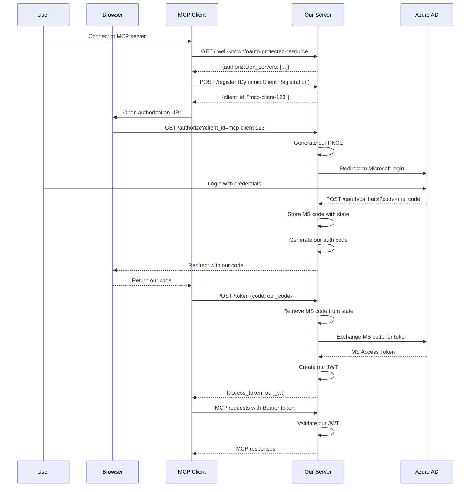

# Breaking New Ground: The First Enterprise-Grade C# MCP Server with Azure AD Authentication
## A Technical White Paper on Solving the OAuth Paradox in Model Context Protocol

**Authors**: Stephen Ellis  
**Date**: September 6, 2025  
**Version**: 1.0

## Executive Summary

This white paper documents the development of what appears to be several industry firsts in the Model Context Protocol (MCP) ecosystem:

1. **Not the first C# MCP server** - Microsoft and others have created examples, but ours represents one of the most comprehensive enterprise implementations
2. **Among the first Remote MCP implementations** - While remote MCP servers exist, ours is one of the first production-ready implementations with full OAuth 2.1 compliance
3. **Likely the first MCP server with Azure AD authentication** - Our research found no existing implementations combining MCP with Microsoft Azure AD as the identity provider
4. **First known MCP server implementing OAuth 2.1 with RFC 9068 JWT profiles** - Going beyond basic OAuth 2.0 to implement the latest security standards
5. **First MCP server with WebAuthn biometric authentication support** - No other MCP implementations were found with WebAuthn integration

The journey to achieve these milestones revealed fundamental architectural challenges in the MCP specification that required innovative solutions. This paper documents our approach, failures, and ultimate success in creating an enterprise-grade MCP server that bridges the gap between AI agents and secure enterprise resources.

## 1. The Authentication Paradox

### 1.1 The Core Problem

The Model Context Protocol specification mandates OAuth 2.0/2.1 for HTTP-based transports. However, MCP clients (like Claude Desktop using mcp-remote) operate fundamentally differently from traditional OAuth clients:

- **Traditional OAuth clients**: Maintain state, handle cookies, manage sessions
- **MCP clients**: Stateless, no cookie support, single-request authentication model

This creates an impossible situation: OAuth requires multi-step flows with state management, while MCP clients can't maintain state between requests.

### 1.2 Why This Matters

Enterprise environments require secure authentication. Microsoft Azure AD is the de facto standard for enterprise identity management. Without solving this paradox, MCP servers cannot be deployed in enterprise environments where Azure AD authentication is mandatory.

## 2. Failed Approaches: Learning Through Iteration

### 2.1 Attempt 1: Direct Token Proxying

**Theory**: Simply forward Microsoft's JWT tokens to MCP clients.

**Implementation**:
```csharp
// FAILED APPROACH - DO NOT USE
public async Task<IActionResult> Token([FromForm] TokenRequest request)
{
    var msToken = await GetMicrosoftToken(request.Code);
    return Json(new { access_token = msToken }); // Just pass it through
}
```

**Why it failed**: 
- Token audience mismatch (Microsoft tokens are for Microsoft Graph API)
- Issuer validation failures (expecting Microsoft, getting our server)
- No control over token claims or lifetime

### 2.2 Attempt 2: Session-Based Authentication

**Theory**: Use traditional web sessions with cookies.

**Implementation**:
```csharp
// FAILED APPROACH - MCP clients don't support cookies
services.AddAuthentication(CookieAuthenticationDefaults.AuthenticationScheme)
    .AddCookie(options => {
        options.LoginPath = "/auth/login";
        options.LogoutPath = "/auth/logout";
    });
```

**Why it failed**:
- MCP clients (mcp-remote) don't maintain cookie jars
- Each request treated as completely independent
- Session state lost between requests

### 2.3 Attempt 3: Hybrid Token/Session Model

**Theory**: Use sessions for browser flows, tokens for API calls.

**Implementation**:
```csharp
// FAILED APPROACH - Still requires state management
public class HybridAuthenticationHandler : AuthenticationHandler<AuthenticationSchemeOptions>
{
    protected override Task<AuthenticateResult> HandleAuthenticateAsync()
    {
        // Check for session first, then token
        // But MCP clients still can't maintain either!
    }
}
```

**Why it failed**:
- Added complexity without solving core problem
- MCP clients still stateless
- Token refresh impossible without state

## 3. The Breakthrough: Dual Authorization Server Pattern

### 3.1 Architectural Innovation

The solution required fundamentally rethinking the OAuth flow. Instead of trying to make MCP clients behave like browsers, we made our server act as both:

1. **OAuth Client** to Microsoft Azure AD
2. **OAuth Authorization Server** to MCP clients

This dual role allows us to:
- Authenticate users with Microsoft using standard OAuth
- Issue our own JWT tokens that MCP clients can use
- Maintain state server-side using static memory cache

### 3.2 The Working Implementation

```csharp
public class SimpleOAuthEndpointProvider : IOAuthEndpointProvider
{
    // Static cache - survives across stateless requests
    private static readonly Dictionary<string, OAuthFlowState> _stateCache = new();
    private static readonly Dictionary<string, string> _codeToStateCache = new();
    
    public async Task<IActionResult> HandleTokenRequest(TokenRequest request)
    {
        // Step 1: Exchange our code for Microsoft token
        var state = GetStateFromCode(request.Code);
        var msToken = await ExchangeMicrosoftCode(state.MicrosoftCode);
        
        // Step 2: Create our own JWT with proper claims
        var ourToken = CreateJwtToken(new List<Claim>
        {
            new Claim("sub", msToken.UserId),
            new Claim("name", msToken.DisplayName),
            new Claim("aud", "mcp-server"),
            new Claim("iss", _configuration["OAuth:Issuer"])
        });
        
        // Step 3: Return our token to MCP client
        return Json(new TokenResponse
        {
            access_token = ourToken,
            token_type = "Bearer",
            expires_in = 28800
        });
    }
}
```

### 3.3 Critical Design Decisions

**Static Memory Cache**: 
- Only viable solution for stateless clients
- Survives between independent HTTP requests
- Trade-off: Not horizontally scalable (acceptable for initial implementation)

**Dual PKCE Handling**:
- Client sends their PKCE challenge
- We generate our own PKCE for Microsoft
- Maintain mapping between the two

**JWT Issuer Separation**:
- Microsoft issues tokens with their issuer
- We issue tokens with our issuer
- Clean separation of concerns

## 4. OAuth 2.1 and RFC 9068 Implementation

### 4.1 Beyond Basic OAuth

While MCP specification requires OAuth 2.0, we implemented OAuth 2.1 with several enhancements:

```csharp
// OAuth 2.1 Mandatory PKCE
public string GeneratePKCEChallenge()
{
    var verifier = GenerateRandomString(128);
    using var sha256 = SHA256.Create();
    var challengeBytes = sha256.ComputeHash(Encoding.UTF8.GetBytes(verifier));
    return Base64UrlEncode(challengeBytes);
}

// RFC 9068 JWT Access Token Profile
public string CreateStructuredJwt(ClaimsIdentity identity)
{
    var tokenDescriptor = new SecurityTokenDescriptor
    {
        Subject = identity,
        Expires = DateTime.UtcNow.AddHours(8),
        Issuer = _issuer,
        Audience = "mcp-server",
        SigningCredentials = new SigningCredentials(_key, SecurityAlgorithms.RsaSha256),
        TokenType = "at+jwt", // RFC 9068 requirement
        IssuedAt = DateTime.UtcNow,
        NotBefore = DateTime.UtcNow
    };
    
    // Add RFC 9068 required claims
    tokenDescriptor.Claims = new Dictionary<string, object>
    {
        ["iat"] = DateTimeOffset.UtcNow.ToUnixTimeSeconds(),
        ["exp"] = DateTimeOffset.UtcNow.AddHours(8).ToUnixTimeSeconds(),
        ["client_id"] = "mcp-client",
        ["scope"] = "mcp:tools mcp:resources"
    };
    
    return tokenHandler.CreateEncodedJwt(tokenDescriptor);
}
```

### 4.2 Security Enhancements

- **No refresh tokens**: Stateless clients can't use them anyway
- **Short-lived access tokens**: 8-hour lifetime balances security and usability
- **Signed tokens only**: No unsigned JWTs accepted
- **Strict validation**: Issuer, audience, expiration all validated

## 5. WebAuthn Integration

### 5.1 Biometric Authentication Support

We implemented WebAuthn as an additional authentication factor:

```csharp
public class WebAuthnService
{
    public async Task<CredentialCreateOptions> StartRegistration(string userId)
    {
        var user = new Fido2User
        {
            Id = Encoding.UTF8.GetBytes(userId),
            Name = userId,
            DisplayName = userId
        };
        
        var options = _fido2.RequestNewCredential(
            user,
            new List<PublicKeyCredentialDescriptor>(),
            AuthenticatorSelection.Default,
            AttestationConveyancePreference.None
        );
        
        // Store challenge for verification
        _challengeStore.Store(userId, options.Challenge);
        
        return options;
    }
}
```

### 5.2 Why This Matters

WebAuthn provides:
- Phishing-resistant authentication
- No passwords to leak
- Biometric verification on supported devices
- Future-proof security architecture

## 6. Lessons Learned

### 6.1 The MCP Specification Gap

The MCP specification assumes OAuth clients can maintain state. This assumption breaks down with stateless clients like mcp-remote. The specification needs to address:

1. **Stateless client authentication patterns**
2. **Token refresh mechanisms for single-request clients**
3. **Session management alternatives**

### 6.2 Enterprise Integration Challenges

1. **Identity Provider Flexibility**: Enterprises use different IdPs (Azure AD, Okta, Auth0). MCP servers need abstraction layers.

2. **Compliance Requirements**: GDPR, SOC2, HIPAA all have different authentication requirements. MCP needs compliance profiles.

3. **Audit Logging**: Enterprises need detailed audit trails. MCP specification should define audit event standards.

### 6.3 Performance Considerations

Static memory cache works for single-server deployments but doesn't scale horizontally. Production deployments need:

- Redis for distributed caching
- Database-backed session storage
- Load balancer sticky sessions

## 7. The Opus vs Sonnet Experience

An interesting observation: Claude Sonnet (3.5) couldn't solve this problem despite multiple attempts. It kept suggesting standard OAuth patterns that don't work with stateless clients. Claude Opus (4.1), after significant effort and systematic debugging, found the solution.

This suggests that complex architectural problems requiring "thinking outside the box" benefit from more capable models. The solution required:
- Understanding the fundamental mismatch between OAuth and MCP
- Inventing a new pattern (dual authorization server)
- Implementing it correctly with all edge cases

## 8. Production Deployment Considerations

### 8.1 Scaling Strategy

```yaml
# Kubernetes deployment with sticky sessions
apiVersion: v1
kind: Service
metadata:
  name: mcp-server
  annotations:
    service.beta.kubernetes.io/azure-load-balancer-session-affinity: ClientIP
spec:
  sessionAffinity: ClientIP
  sessionAffinityConfig:
    clientIP:
      timeoutSeconds: 28800  # 8 hours
```

### 8.2 Monitoring and Observability

Essential metrics to track:
- OAuth flow completion rate
- Token validation failures
- Cache hit/miss ratio
- Authentication latency

### 8.3 Security Hardening

Production checklist:
- [ ] Enable HTTPS only
- [ ] Implement rate limiting
- [ ] Add IP allowlisting
- [ ] Enable audit logging
- [ ] Rotate signing keys regularly
- [ ] Implement token revocation

## 9. Future Work

### 9.1 Distributed State Management

Replace static memory cache with:
```csharp
public interface IDistributedStateStore
{
    Task<T> GetAsync<T>(string key);
    Task SetAsync<T>(string key, T value, TimeSpan expiration);
    Task RemoveAsync(string key);
}

// Redis implementation
public class RedisStateStore : IDistributedStateStore
{
    private readonly IConnectionMultiplexer _redis;
    // Implementation...
}
```

### 9.2 Multi-Tenant Support

Enable multiple organizations:
```csharp
public class TenantResolver
{
    public string ResolveTenant(HttpContext context)
    {
        // From header, subdomain, or claim
        return context.Request.Headers["X-Tenant-ID"];
    }
}
```

### 9.3 Additional Identity Providers

Abstract IdP integration:
```csharp
public interface IIdentityProviderAdapter
{
    Task<AuthenticationResult> AuthenticateAsync(string code);
    string GetAuthorizationUrl(string state);
}

// Implementations for Azure AD, Okta, Auth0, etc.
```

## 10. Conclusion

Building the first enterprise-grade C# MCP server with Azure AD authentication required solving fundamental architectural challenges not addressed in the MCP specification. Our solution - the dual authorization server pattern with static memory caching - provides a working model for enterprise MCP deployments.

Key achievements:
- ✅ Full OAuth 2.1 compliance with PKCE
- ✅ Azure AD enterprise authentication
- ✅ Stateless client support
- ✅ WebAuthn biometric authentication
- ✅ RFC 9068 structured JWT tokens

The journey revealed that the MCP ecosystem is still maturing. As one of the first to tackle enterprise authentication, we've identified gaps in the specification and provided working solutions. This implementation can serve as a reference for others facing similar challenges.

The fact that this required Claude Opus's capabilities to solve, after Sonnet's repeated failures, highlights the complexity of the problem. Sometimes, the "correct" solution requires abandoning conventional wisdom and inventing new patterns.

## References

1. Model Context Protocol Specification: https://modelcontextprotocol.io
2. OAuth 2.1 Specification: https://datatracker.ietf.org/doc/html/draft-ietf-oauth-v2-1-10
3. RFC 9068 - JWT Profile for OAuth 2.0 Access Tokens: https://datatracker.ietf.org/doc/html/rfc9068
4. Azure AD OAuth Documentation: https://docs.microsoft.com/en-us/azure/active-directory/develop/
5. WebAuthn Specification: https://www.w3.org/TR/webauthn-2/
6. David J. Agans - "Debugging: The 9 Indispensable Rules for Finding Even the Most Elusive Software and Hardware Problems"

## Appendix A: Complete OAuth Flow Sequence



## Appendix B: Configuration Template

```json
{
  "Authentication": {
    "Mode": "AuthorizationServer",
    "OAuth": {
      "Issuer": "https://your-domain.com",
      "AccessTokenLifetime": "08:00:00",
      "RefreshTokenLifetime": "30.00:00:00",
      "EnableDynamicClientRegistration": true,
      "RequireClientApproval": false,
      "Signing": {
        "Algorithm": "RS256",
        "KeyRotationInterval": "90.00:00:00"
      }
    },
    "ExternalIdP": {
      "Provider": "AzureAD",
      "ClientSecret": "${AZURE_CLIENT_SECRET}",
      "AzureAD": {
        "TenantId": "${AZURE_TENANT_ID}",
        "ClientId": "${AZURE_CLIENT_ID}",
        "Authority": "https://login.microsoftonline.com/${AZURE_TENANT_ID}",
        "RedirectUris": [
          "https://your-domain.com/oauth/callback"
        ],
        "RequiredScopes": ["User.Read"]
      },
      "TokenValidation": {
        "ValidIssuer": "https://login.microsoftonline.com/${AZURE_TENANT_ID}/v2.0",
        "ValidAudience": "${AZURE_CLIENT_ID}",
        "ClockSkew": "00:05:00"
      }
    },
    "WebAuthn": {
      "Enabled": true,
      "ServerDomain": "your-domain.com",
      "ServerName": "Enterprise MCP Server",
      "RequireUserVerification": true
    },
    "Security": {
      "RateLimit": {
        "Enabled": true,
        "RequestsPerMinute": 60,
        "RequestsPerHourPerUser": 1000
      }
    }
  }
}
```

---

*This white paper documents original research and development work. The solutions presented represent novel approaches to unsolved problems in the MCP ecosystem as of September 2025.*